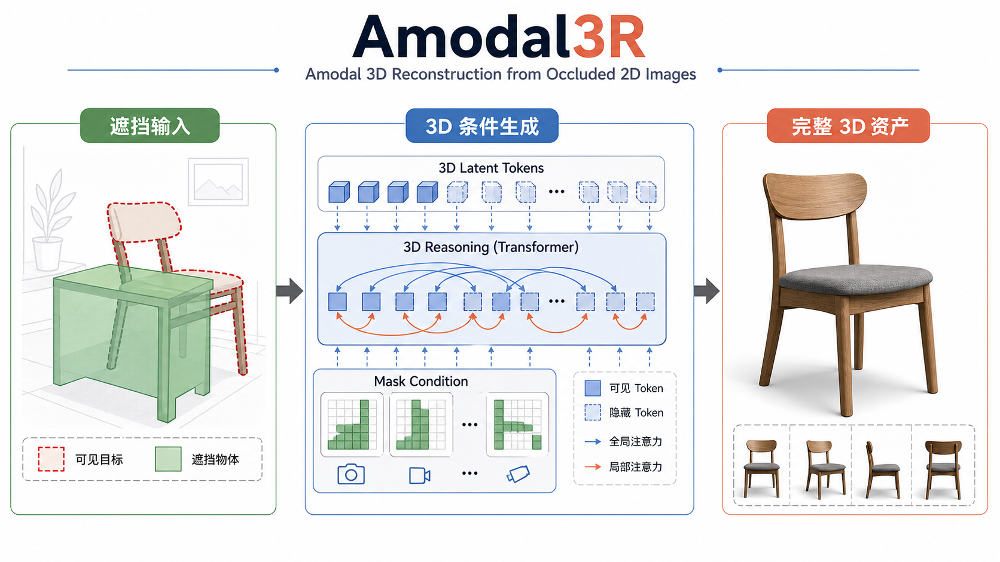
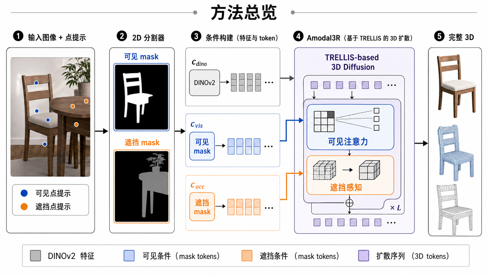
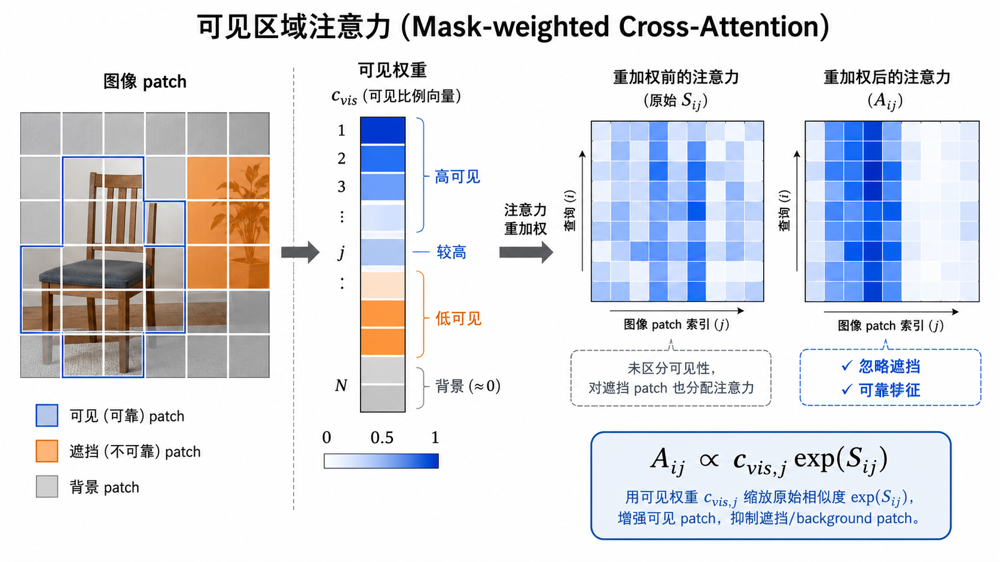
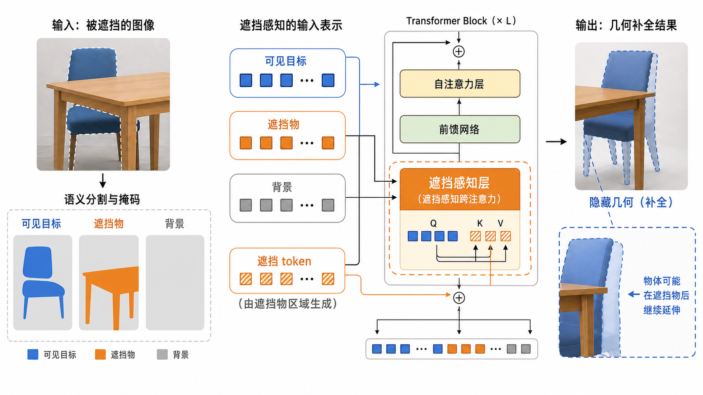
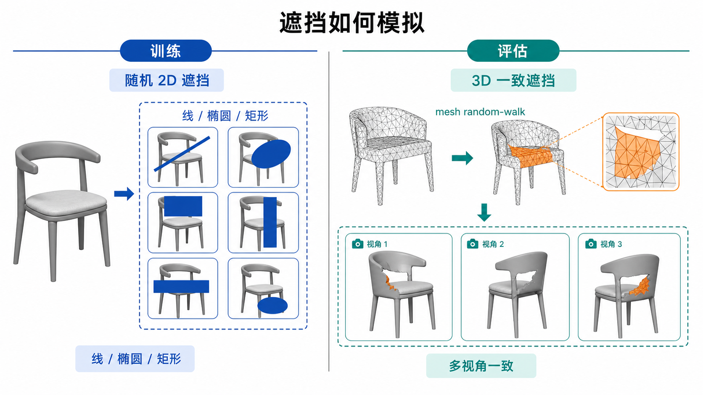
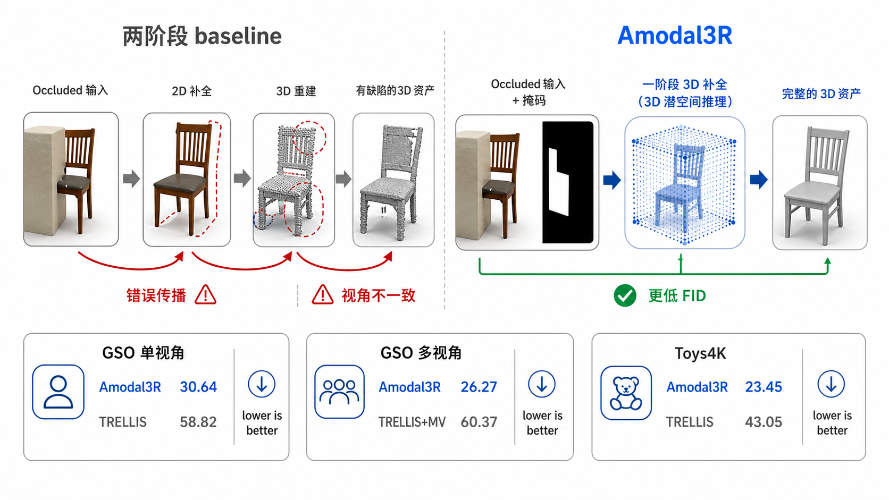

# Amodal3R - 方法图解

## 论文信息

- 论文：Amodal3R: Amodal 3D Reconstruction from Occluded 2D Images
- 本地 PDF：`/Users/kongsanjin/Desktop/Paper-Reading/Amodal3R_2503.13439.pdf`
- 风格：paper-figure
- 语言：中文
- 页数：6

## 页面规划

### 01. 封面图：从遮挡 2D 输入到完整 3D 资产

### 02. 方法总览：输入、mask、DINOv2、Amodal3R transformer、输出

### 03. 核心机制 A：Mask-weighted Cross-Attention

### 04. 核心机制 B：Occlusion-aware Attention Layer

### 05. 训练与评估遮挡模拟：随机 2D mask 与 3D-consistent mask

### 06. 关键结果：一阶段 3D 补全优于两阶段 pipeline

## 总结

1. Amodal3R 的本质是把遮挡补全放进 3D latent generation，而不是先做 2D 图像补全。
2. `M_vis` 负责告诉模型哪些图像特征可靠，`M_occ` 负责告诉模型哪些不可见区域需要推理。
3. 两个 attention 机制互补：前者改善外观读取，后者改善隐藏几何推理。
